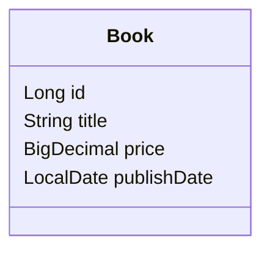
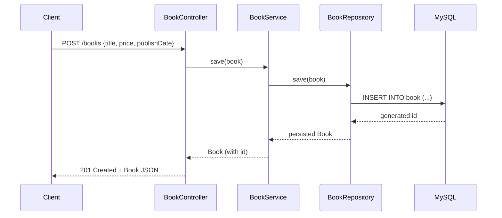
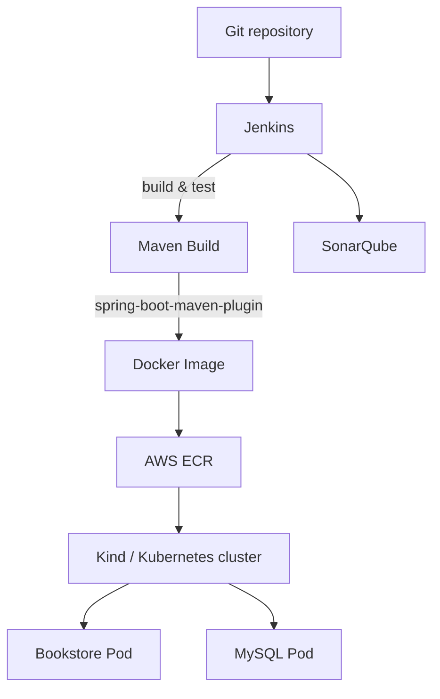

## Spring Boot Bookstore — Architecture & Structure

**Purpose**: Provide a comprehensive, visual and textual structure document for the project. This file contains system diagrams, API surface, data model, deployment notes, and a file map with links to source files.

---

**System Overview**

```mermaid
flowchart LR
  Client[Client (curl / browser / test)] -->|HTTP| API[BookController (/books)]
  API --> Service[BookService]
  Service --> Repo[BookRepository (Spring Data JPA)]
  Repo --> DB[(MySQL)]
  API --> Actuator[Actuator & Health Endpoints]
  Actuator -->|metrics| Prom[Prometheus]
  Jenkins[Jenkins & CI] -. deploy .-> Docker[Docker / Image -> ECR]
  Docker -. deploy .-> K8s[Kind / Kubernetes]
  Jenkins -. quality .-> Sonar[SonarQube]
```

**Key properties**
- **Port:** 8080 (app), 3306 (MySQL)
- **Base path:** `/books`
- **DB URL:** configured in `src/main/resources/application.properties` ([application.properties](src/main/resources/application.properties))

---

**API Surface (endpoints)**

- `GET /books` — list all books
- `GET /books/{id}` — get book by id
- `POST /books` — create a book (request body: Book JSON) — returns 201
- `PUT /books` — update a book (request body: Book JSON)
- `DELETE /books/{id}` — delete a book — returns 204
- `GET /books/find/title/{title}` — list by title
- `GET /books/find/date-after/{yyyy-MM-dd}` — list books published after date

Refer to controller: [src/main/java/com/mkyong/book/BookController.java](src/main/java/com/mkyong/book/BookController.java)

---

**Data Model**



- Persistent entity: `@Entity` mapped by JPA. See [src/main/java/com/mkyong/book/Book.java](src/main/java/com/mkyong/book/Book.java)

Field details:
- `id` — PK, autogenerated
- `title` — book title
- `price` — `BigDecimal` for currency
- `publishDate` — `LocalDate`, pattern `yyyy-MM-dd`

---

**Component Responsibilities**

- `BookController` — HTTP endpoints, input mapping, status codes
- `BookService` — Business layer, orchestrates repository operations
- `BookRepository` (JpaRepository) — Data access, derived queries + custom JPQL
- `MySQL` — persistence, configured via `spring.datasource.*`
- `Actuator` — health & readiness/liveness endpoints
- `TestContainers` — integration test MySQL lifecycle (see tests)

---

**Sequence: Create Book (POST /books)**



---

**Persistence & Test Approach**

- Production (dev local): MySQL container recommended (README run instructions). See `README.md` ([README.md](README.md)).
- Tests use `Testcontainers` to spin up MySQL for integration tests: see [src/test/java/com/mkyong/BookControllerTest.java](src/test/java/com/mkyong/BookControllerTest.java).
- JPA DDL is set to `create-drop` for tests in `@TestPropertySource` and application uses `spring.jpa.hibernate.ddl-auto=create-drop` in properties for local testing.

---

**Deployment Architecture (high level)**



Notes:
- CI uses the `pom.xml` plugins (Spring Boot plugin, JaCoCo, OWASP Dependency Check). See [pom.xml](pom.xml).
- The repo contains `Dockerfile`, `deploybackend.yml`, `deploymysql.yml` and other deployment manifests under `deployments/`.

---

**Operational / Observability**

- Actuator endpoints: `/actuator/health/liveness`, `/actuator/health/readiness` (enabled via properties). See `application.properties` ([application.properties](src/main/resources/application.properties)).
- Metrics: Micrometer Prometheus registry is included in `pom.xml`.

---

**File Map (important files)**

- [README.md](README.md)
- [pom.xml](pom.xml)
- [Dockerfile](Dockerfile)
- [StartApplication.java](src/main/java/com/mkyong/StartApplication.java)
- [BookController.java](src/main/java/com/mkyong/book/BookController.java)
- [BookService.java](src/main/java/com/mkyong/book/BookService.java)
- [BookRepository.java](src/main/java/com/mkyong/book/BookRepository.java)
- [Book.java](src/main/java/com/mkyong/book/Book.java)
- [application.properties](src/main/resources/application.properties)
- [BookControllerTest.java](src/test/java/com/mkyong/BookControllerTest.java)
- [deployments/](deployments/) — Kubernetes manifests

---

**How to visualize diagrams locally**

1. Use any Markdown viewer that supports Mermaid (VS Code + Mermaid preview, GitHub, GitLab).
2. Or render diagrams separately using Mermaid CLI and embed images.

---

If you want, I can:
- render the Mermaid diagrams to image files and add them to the repo, or
- open a short README section with run/debug instructions and CI suggestions.